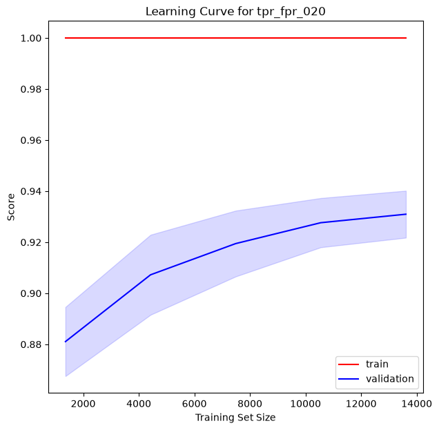
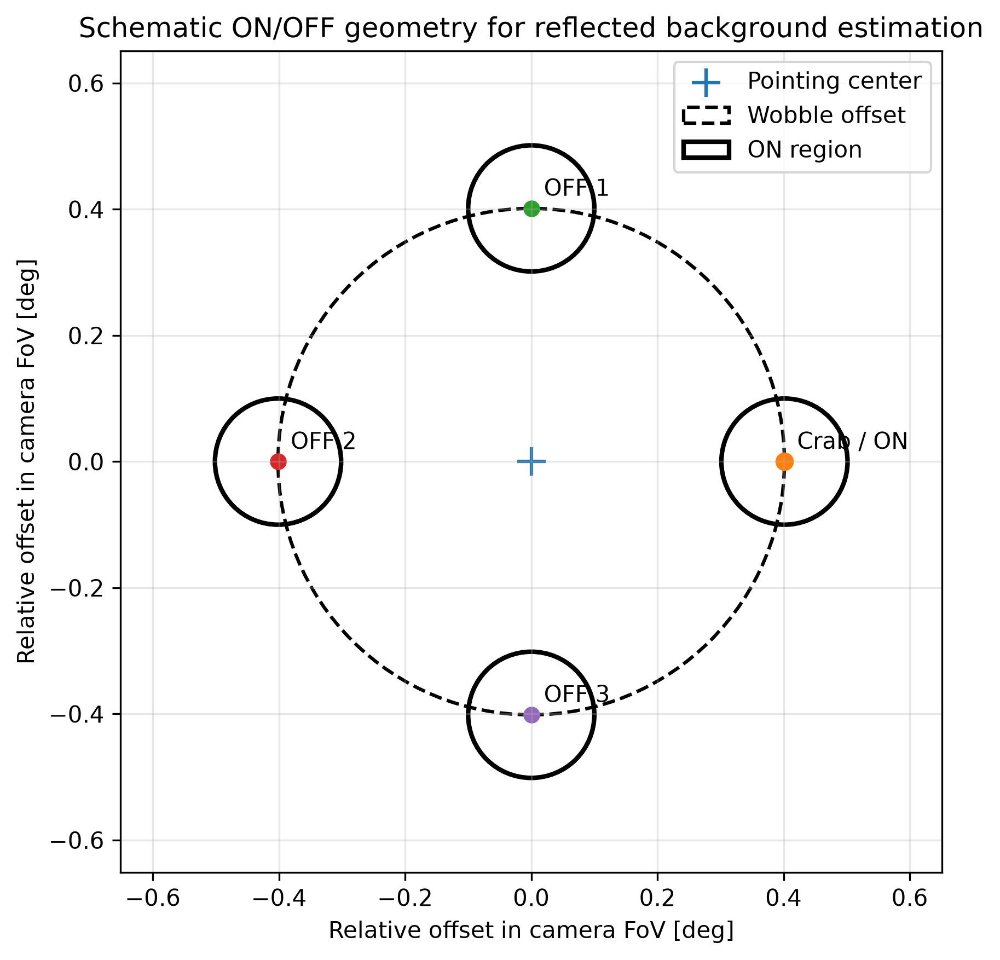
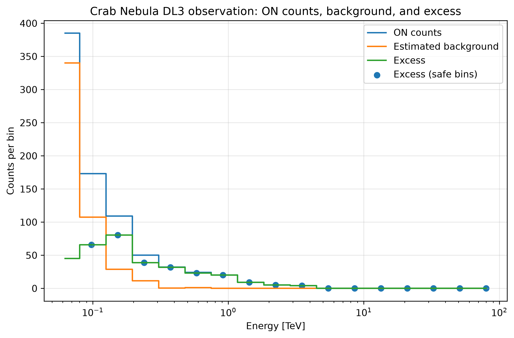
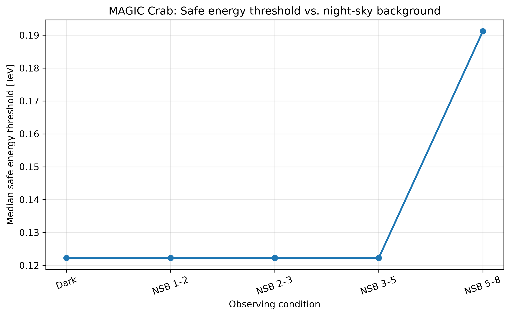
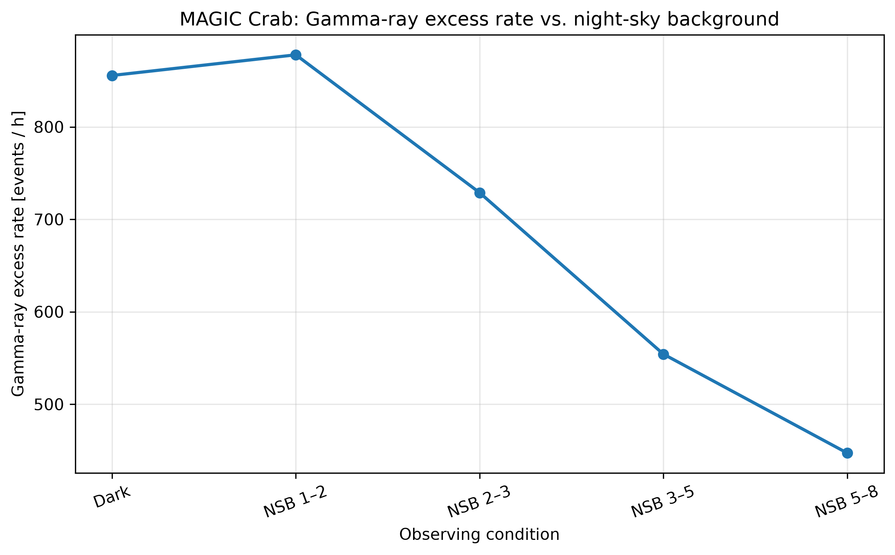
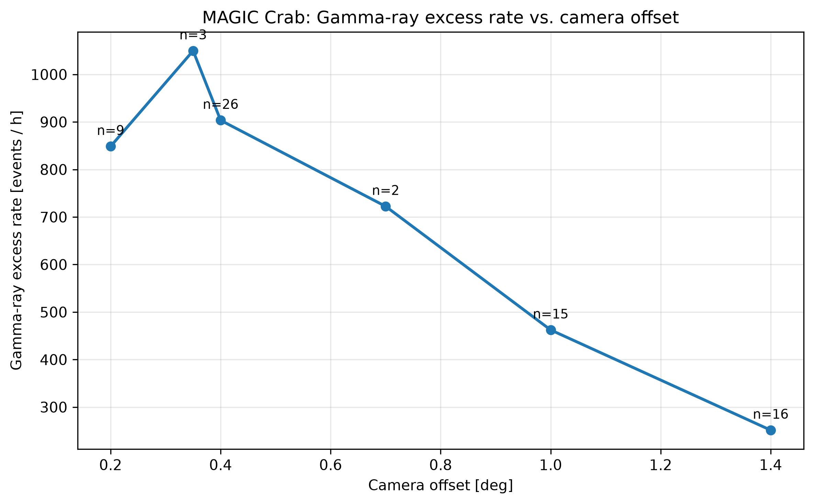

# From Simulation to Reality: Gamma-Ray Analysis with the MAGIC Telescope

## Project Overview

This project investigates gamma-ray event analysis with the **MAGIC (Major Atmospheric Gamma Imaging Cherenkov) Telescope** from two complementary perspectives:

1. **Supervised machine learning on Monte-Carlo simulated events** using the UCI MAGIC Gamma Telescope dataset.
2. **Statistical signal extraction from real MAGIC DL3 observations** using publicly available Crab Nebula data.

The first part addresses the classification of gamma-ray induced air showers and hadronic background events based on reconstructed shower-image parameters.

The second part moves from simulation to real telescope observations. Real DL3 events do **not** provide per-event gamma/hadron ground-truth labels, so the analysis uses an **ON/OFF background-estimation approach** instead of supervised classification.

Together, both parts illustrate an important challenge in scientific machine learning:

> A model can be trained and evaluated with ground truth in simulation, while real observations require statistical inference and careful treatment of background.

The project therefore combines machine learning, domain-specific evaluation, scientific data analysis, and the transition from simulated to real-world data.

---

## Research Questions

1. How accurately can gamma-ray events be separated from hadronic background using simulated MAGIC shower-image parameters?
2. How does model performance change when very low false-positive rates are required?
3. How does the supervised simulation-based classification problem relate to the analysis of real MAGIC telescope observations where event-level ground truth is unavailable?

---

## Data Sources

### 1. Simulated MAGIC events — UCI Machine Learning Repository

The machine-learning part uses the **MAGIC Gamma Telescope** dataset from the UCI Machine Learning Repository:

- 19,020 Monte-Carlo simulated events
- 10 numerical shower-image parameters
- binary target: gamma (`g`) or hadron (`h`)
- no missing values

Source: [UCI MAGIC Gamma Telescope](https://archive.ics.uci.edu/dataset/159/magic+gamma+telescope)  
DOI: [10.24432/C52C8B](https://doi.org/10.24432/C52C8B)

### 2. Real MAGIC observations — DL3 Public Data Release 1

The real-data part uses the **MAGIC Data Level 3 (DL3) Public Data Release 1**, containing approximately 60 hours of Crab Nebula observations acquired between 2013 and 2018.

Source: [MAGIC DL3 Public Data Release 1 on Zenodo](https://zenodo.org/records/11108474)  
DOI: [10.5281/zenodo.11108474](https://doi.org/10.5281/zenodo.11108474)

The DL3 files follow the Gamma Astro Data Formats (GADF) convention and contain reconstructed event quantities and instrument response functions.

---

## Part I — Gamma/Hadron Classification on Simulated Data

### Dataset and Target

The UCI dataset contains ten original numerical features describing the geometry, intensity, concentration, asymmetry, and orientation of recorded shower images.

| Feature | Unit | Description |
|---|---:|---|
| `fLength` | mm | Length of the major axis of the fitted shower ellipse |
| `fWidth` | mm | Length of the minor axis |
| `fSize` | #phot (log) | Logarithmic total light content |
| `fConc` | – | Fraction of light in the two brightest pixels |
| `fConc1` | – | Fraction of light in the brightest pixel |
| `fAsym` | mm | Position of the brightest pixel along the major axis |
| `fM3Long` | mm | Third-moment information along the major axis |
| `fM3Trans` | mm | Third-moment information along the minor axis |
| `fAlpha` | deg | Orientation of the shower ellipse relative to the camera center |
| `fDist` | mm | Distance of the ellipse center from the camera center |

Target encoding:

| Target | Meaning | Encoded value |
|---|---|---:|
| Gamma (`g`) | signal | `1` |
| Hadron (`h`) | background | `0` |

The simulated sample contains more gamma than hadron events. In real telescope data, however, background events are much more abundant. This makes background rejection particularly important.

---

### Why Accuracy Is Not the Main Metric

A generic classification accuracy is not sufficient for this problem.

A **false positive** corresponds to a hadronic background event being accepted as a gamma candidate. In gamma-ray astronomy, such background contamination can be more problematic than rejecting some true gamma events.

With gamma events defined as the positive class:

- **False Positive Rate (FPR):** fraction of hadron events incorrectly classified as gamma
- **True Positive Rate (TPR):** fraction of gamma events correctly identified as gamma
- **TPR** is also referred to as recall or gamma efficiency

The project therefore evaluates the maximum achievable TPR under predefined FPR constraints:

```text
FPR <= 0.01
FPR <= 0.02
FPR <= 0.05
FPR <= 0.10
FPR <= 0.20
```

A custom scorer is used to determine the best TPR that satisfies each FPR limit.

This shifts model optimization toward the scientifically relevant region of the ROC curve instead of optimizing a generic metric such as accuracy.

---

### Exploratory Data Analysis

The exploratory analysis examines:

- class-dependent feature distributions
- correlations and potential feature redundancy
- potential outliers
- nonlinear relationships
- multivariate feature interactions
- physically motivated feature engineering

Several nonlinear relationships are visible in the original features. The orientation feature `fAlpha` shows particularly strong univariate separation between the two classes, while image morphology and light-concentration variables provide complementary information.

<p align="center">
  
</p>

---

### Feature Engineering

Additional features were derived from the original telescope parameters, including:

```text
width_length_ratio
ellipse_area
abs_fAsym
abs_fM3Long
abs_fM3Trans
second_pixel_conc
brightest_pixel_share
alpha_alignment
```

These engineered features capture additional information about:

- shower-image geometry
- absolute asymmetry
- light concentration
- relative dominance of bright pixels
- alignment of the shower image with the camera center

For example, `alpha_alignment` maps the original `fAlpha` orientation into an intuitive 0–1 representation in which larger values correspond to stronger alignment with the camera center.

---

### Modeling Strategy

Model selection is based on **stratified cross-validation** on the training data. The independent test set remains untouched during feature engineering, hyperparameter tuning, and model selection.

The following model families are evaluated:

#### Logistic Regression

Used as the linear baseline and evaluated:

- without PCA
- with PCA
- after Bayesian hyperparameter optimization

#### Support Vector Machine

A nonlinear SVM is investigated because the exploratory analysis indicates nonlinear decision boundaries.

Important hyperparameters such as `C` and `gamma` are optimized.

#### Neural Network

A scikit-learn `MLPClassifier` is used to evaluate whether a neural-network-based approach is beneficial for this dataset.

#### Random Forest

Random Forest performs particularly strongly during model comparison and is subsequently optimized using a broader hyperparameter search.

Bayesian hyperparameter optimization is implemented with **Optuna**.

---

### Hyperparameter Optimization

Instead of optimizing every model for accuracy or generic ROC-AUC, optimization focuses directly on the domain-specific TPR-at-FPR objective.

Separate optimization runs can therefore target different operating points:

```text
TPR @ FPR <= 0.01
TPR @ FPR <= 0.02
TPR @ FPR <= 0.05
TPR @ FPR <= 0.10
TPR @ FPR <= 0.20
```

This is important because the best model configuration can depend on how strongly background contamination must be suppressed.

---

### Model Selection and Independent Test Evaluation

Model selection is performed exclusively on the training data using cross-validation.

The test data are **not used** for:

- feature engineering decisions
- hyperparameter optimization
- model comparison
- model selection

Only after selecting the best-performing model for an operating point is the independent test set evaluated.

<p align="center">
  
</p>

The comparison shows that nonlinear models outperform the linear baseline, with the optimized Random Forest providing the strongest overall performance across the investigated operating points.

---

### Model Interpretation

#### Learning Curves

The learning curves demonstrate that the difficulty of the classification problem depends strongly on the FPR constraint.

At strict operating points, training performance can remain substantially above validation performance, indicating a higher-variance regime. At more permissive operating points, training and validation performance converge more closely.

The validation curves also suggest that additional training data could still improve performance, particularly in the strict low-FPR regime.

<p align="center">
  
  
</p>

#### Feature Importance

Permutation feature importance is used to investigate which information contributes most strongly to the domain-specific TPR-at-FPR metric.

The analysis indicates that important information comes from:

- shower-image orientation
- image morphology
- light concentration
- event size

Because several original and engineered features are correlated, individual feature-importance values should be interpreted with care. Feature groups are more informative than isolated rankings.

<p align="center">
  
</p>

---

### Main Findings from the Simulation Study

The main conclusions from the supervised machine-learning part are:

- nonlinear models substantially outperform the simple linear baseline
- the optimized Random Forest provides the strongest overall performance across the investigated operating points
- classification becomes much more difficult as the allowed false-positive rate decreases
- model quality therefore depends strongly on the selected operating point
- orientation, morphology, light concentration, and event size all contribute useful discriminatory information
- domain-specific evaluation reveals behavior that would be hidden by a single generic metric such as accuracy

The low-FPR regime is especially important because it provides the conceptual bridge to real telescope observations, where background events dominate and individual event labels are unavailable.

---

## Part II — From Machine Learning to Real Telescope Data

### Why Add Real MAGIC Data?

The machine-learning part of this project uses simulated telescope events for which the true class is known:

```text
Gamma event  -> signal
Hadron event -> background
```

This makes supervised learning possible. A model can learn which event characteristics are typical for gamma rays and which are more typical for background events.

Real telescope observations are different.

In real MAGIC DL3 data, there is no label telling us whether an individual event is truly a gamma ray or background. Instead, the telescope records reconstructed events from different directions in the sky.

The real-data question therefore changes from

> **"Can a machine-learning model classify this individual event correctly?"**

to

> **"Do we observe more events from the direction of a known gamma-ray source than we would expect from background alone?"**

This is the main connection between the two parts of the project.

---

### How Is a Gamma-Ray Signal Found in Real Data?

The Crab Nebula is a well-known gamma-ray source and is used here as a real-world test case.

The analysis compares two types of sky regions:

- **ON region:** the region where the Crab Nebula is located
- **OFF regions:** nearby control regions used to estimate the background

The basic idea is simple:

```text
events in ON region
- expected background
= gamma-ray excess
```

Because several OFF regions can be used, their event count is scaled by a factor called `alpha`.

Mathematically:

```text
background = alpha × N_OFF

excess = N_ON - background
```

The **excess** is not a list of individually confirmed gamma rays. It is a statistical estimate of how many more events were observed from the source direction than expected from background.

A second quantity, the **significance**, describes how convincing this excess is. A large significance means that the observed excess is very unlikely to be caused by random background fluctuations alone.

<p align="center">
  
</p>

---

### First Real Observation

The workflow was first tested on one approximately 20-minute Crab Nebula observation.

| Quantity | Result |
|---|---:|
| Livetime | 19.6 min |
| Events in ON region | 426 |
| Estimated background | 148.7 |
| Gamma-ray excess | 277.3 |
| Detection significance | 15.1 sigma |

In simple terms:

> The telescope recorded far more events from the Crab Nebula direction than would be expected from background alone.

This validates that the real-data analysis pipeline is able to detect a known gamma-ray source.

<p align="center">
  
</p>

---

### What Happens Under Different Observing Conditions?

After validating the workflow on one observation, the analysis was extended to the complete set of available Crab Nebula observations.

Two practical questions were investigated:

1. Does a brighter night sky make gamma-ray detection more difficult?
2. Does the position of the source inside the telescope camera influence the result?

These effects are especially relevant when moving from simulated machine-learning data to real measurements because real observing conditions are not constant.

---

### 1. Influence of Moonlight and Night-Sky Background

The MAGIC telescope detects extremely short and faint flashes of Cherenkov light produced by particle showers in the atmosphere.

Moonlight and other sources of night-sky illumination increase the optical background seen by the camera. Weak Cherenkov signals can therefore become more difficult to distinguish reliably from background light.

The real observations were grouped according to their **Night-Sky Background (NSB)** level.

The analysis shows that under the brightest conditions:

- the minimum reliably usable energy increases from about **0.12 TeV to 0.19 TeV**
- the measured gamma-ray excess rate decreases from roughly **850–880 events per hour** under dark or low-background conditions to about **450 events per hour**

<p align="center">
  
</p>

<p align="center">
  
</p>

A simple interpretation is:

> Bright sky conditions make weak gamma-ray events more difficult to detect reliably.

The result should not be interpreted as a perfectly controlled sensitivity measurement, because the observation groups also differ in other conditions and some groups contain only a few runs.

Nevertheless, the real data clearly illustrate that observing conditions can influence the usable energy range and the measured source signal.

---

### 2. Influence of the Source Position in the Camera

MAGIC observations are often performed with the source slightly away from the exact center of the camera.

The **camera offset** describes the angular distance between the source position and the telescope pointing direction.

A small offset means that the source is located relatively close to the center of the camera field of view. A large offset places it farther towards the edge.

The multi-offset observations show a clear decrease in the measured excess rate at large offsets:

```text
0.40° offset -> about 904 excess events/hour
1.00° offset -> about 462 excess events/hour
1.40° offset -> about 251 excess events/hour
```

<p align="center">
  
</p>

This behavior is consistent with the telescope becoming less efficient when the source is observed farther away from the camera center.

The groups at 0.35° and 0.70° contain only a small number of observations and should therefore be interpreted cautiously.

---

### Combined Multi-Offset Detection

All 71 multi-offset observations were also combined into one stacked analysis.

| Quantity | Result |
|---|---:|
| Number of observations | 71 |
| Total livetime | 21.16 h |
| Events in ON region | 17,826 |
| Estimated background | 3,985 |
| Gamma-ray excess | 13,841 |
| Detection significance | 124.9 sigma |

The Crab Nebula is therefore detected very clearly across the complete multi-offset dataset.

Again, the excess represents a **statistical source signal**, not 13,841 individually identified gamma rays.

---

## Connection to the Machine-Learning Part

The machine-learning analysis and the DL3 analysis use different methods, but they address the same underlying scientific problem:

> **How can a relatively small gamma-ray signal be separated from a much larger background?**

The difference lies mainly in the information that is available.

| Machine Learning on Simulation | Real MAGIC Observations |
|---|---|
| Events have known gamma/hadron labels | Individual events have no true labels |
| Model learns signal vs. background | Signal is estimated statistically |
| False-positive rate measures accepted background | OFF regions estimate the real background |
| True-positive rate measures retained gamma events | Excess estimates the source-associated signal |
| Performance can be evaluated directly | Detection is evaluated statistically |

The relationship can be summarized as:

```text
SIMULATION / MACHINE LEARNING

Known labels:
gamma vs. hadron

        ↓

Learn which event properties
separate signal from background

        ↓

Evaluate:
How many gamma events are retained?
How much background is falsely accepted?


REAL TELESCOPE DATA

No event-level labels

        ↓

Estimate the background
from control regions

        ↓

Measure:
Is there a statistically significant
excess from the source direction?
```

This also explains why the machine-learning part focuses strongly on the **false-positive rate**.

In gamma-ray astronomy, background events are much more common than true gamma-ray events. Even a classifier that accepts only a small fraction of the background can therefore produce many false gamma candidates.

The same basic challenge reappears in the real-data analysis:

- the machine-learning model tries to **suppress background events**
- the ON/OFF method estimates **how much background remains in the real observation**

Both parts therefore study the same signal-versus-background problem at different stages of the analysis chain.

---

### Why the Real-Data Part Matters

The DL3 analysis also demonstrates an important limitation of simulation-based machine learning:

> Good performance on simulated data does not automatically guarantee identical performance under real observing conditions.

Real observations are influenced by effects such as:

- moonlight and night-sky background
- source position inside the camera
- detector response
- calibration
- changing atmospheric and observational conditions

The DL3 analysis therefore serves as a **reality check** for the machine-learning study.

The machine-learning part shows how gamma and hadron events can be separated when ground-truth labels are available.

The real-data part shows how the same scientific objective — extracting a gamma-ray signal from background — must be approached when those labels no longer exist.

---

### Main Takeaway

The two parts of the project can be summarized in one sentence:

> **Simulation allows us to learn and evaluate signal-background separation at the individual-event level, while real telescope observations require statistical evidence that a source signal remains above the background.**

This transition from simulated classification to real observational inference is the central link between the machine-learning and DL3 parts of the project.


## Repository Structure

```text
project/
|
├── data/
│   ├── uci/
│   │   ├── raw/
│   │   │   ├── magic04.data
│   │   │   └── magic04.names
│   │   ├── interim/
│   │   └── processed/
│   │
│   └── dl3/
│       └── raw/
│           └── MAGIC DL3 FITS data
|
├── notebooks/
│   ├── uci_ml/
│   │   ├── Gamma_EDA.ipynb
│   │   └── Gamma_models_thresholds.ipynb
│   │
│   └── dl3_real_data/
│       └── MAGIC_DL3.ipynb
|
├── results/
│   ├── ml/
│   │   ├── figures/
│   │   └── tables/
│   │
│   └── dl3/
│       ├── figures/
│       └── tables/
|
├── src/
│   └── portfolio_projekt/
│       ├── paths.py
│       └── ml/
│           ├── __init__.py
│           ├── baseline_model.py
│           ├── features.py
│           ├── log_reg.py
│           ├── neural_network.py
│           ├── random_forest.py
│           ├── resample.py
│           └── support_vector_machine.py
|
├── pyproject.toml
├── .gitignore
└── README.md
```

The notebooks contain the analytical workflow, visualizations, experiments, and interpretation.

Reusable implementation code is located in the `portfolio_projekt` package under `src/`, while project paths are defined centrally in `paths.py`.

---

## Technologies

### Machine Learning

- Python
- pandas
- NumPy
- Matplotlib
- seaborn
- scikit-learn
- imbalanced-learn
- Optuna
- Jupyter

### Scientific / Real-Data Analysis

- Astropy
- Gammapy
- FITS / GADF data

### Project Management

- Git / GitHub
- `uv`
- VS Code

---

## Environment

The project uses a `pyproject.toml` configuration and `uv` for dependency management.

The machine-learning workflow and the real-data workflow are kept conceptually separate because scientific astronomy packages can impose additional dependency constraints.

The DL3 analysis was validated with:

```text
Gammapy 2.1
regions 0.11
```

A separate DL3 virtual environment can therefore be useful when reproducing the astronomy workflow.

---

## Workflow

```text
                         MAGIC Gamma-Ray Analysis
                                   |
                  +----------------+----------------+
                  |                                 |
                  v                                 v
          Monte-Carlo Simulation             Real MAGIC DL3
                (UCI)                          Observations
                  |                                 |
                  v                                 v
        Exploratory Data Analysis             Event Selection
                  |                                 |
                  v                                 v
          Feature Engineering                   ON Region
                  |                                 |
                  v                                 v
           Baseline Model                    Reflected OFF Regions
                  |                                 |
                  v                                 v
       LR / SVM / RF / MLP Models            Background Estimate
                  |                                 |
                  v                                 v
        Optuna Optimization                     Excess
                  |                                 |
                  v                                 v
       TPR @ constrained FPR                  Significance
                  |                                 |
                  +---------------+-----------------+
                                  |
                                  v
                       Simulation-to-Reality
                           Interpretation
```

---


## Conclusion

This project combines supervised machine learning on simulated events with statistical analysis of real telescope observations.

The simulation study shows that nonlinear models are well suited to gamma/hadron separation and that performance strongly depends on the allowed false-positive rate. The optimized Random Forest provides the strongest overall performance among the investigated approaches.

The real-data analysis demonstrates why the problem changes fundamentally outside simulation: event-level truth labels disappear, background must be estimated statistically, and conclusions are drawn from populations of events rather than individual classifications.

The central lesson of the project is therefore broader than the choice of classifier:

> Scientific machine learning requires not only predictive performance, but also evaluation metrics, validation strategies, and inference methods that reflect the structure of the real measurement problem.

The project demonstrates that machine-learning-based gamma/hadron classification can serve as an effective event-level preselection step in a realistic Cherenkov-telescope analysis pipeline. A trained classifier can substantially reduce hadronic background before subsequent reconstruction and scientific analysis.

However, the classifier does not replace the astronomical background estimation itself. Even highly gamma-like event selections still contain residual background, so methods such as ON/OFF analysis or likelihood-based background modeling remain necessary to derive robust source detections, spectra, and flux estimates.

In this sense, the developed model represents a realistic intermediate processing step: it filters and ranks individual events, while the final astrophysical interpretation is performed statistically on the remaining event sample.

---

## Data Credits

- R. Bock, **MAGIC Gamma Telescope**, UCI Machine Learning Repository. DOI: [10.24432/C52C8B](https://doi.org/10.24432/C52C8B)
- MAGIC Collaboration, **MAGIC Data Level 3 (DL3) Public Data Release 1 (PDR1)**, Zenodo. DOI: [10.5281/zenodo.11108474](https://doi.org/10.5281/zenodo.11108474)
