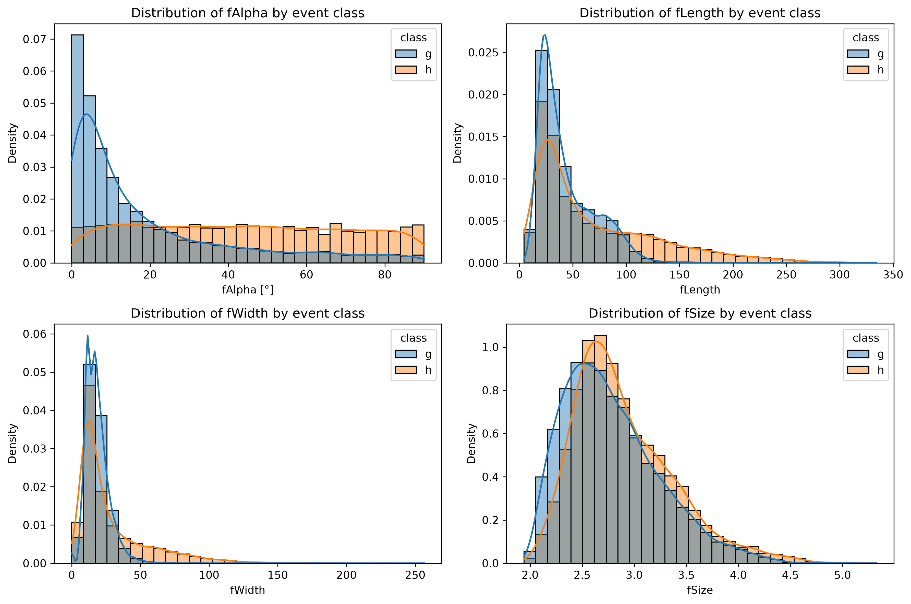
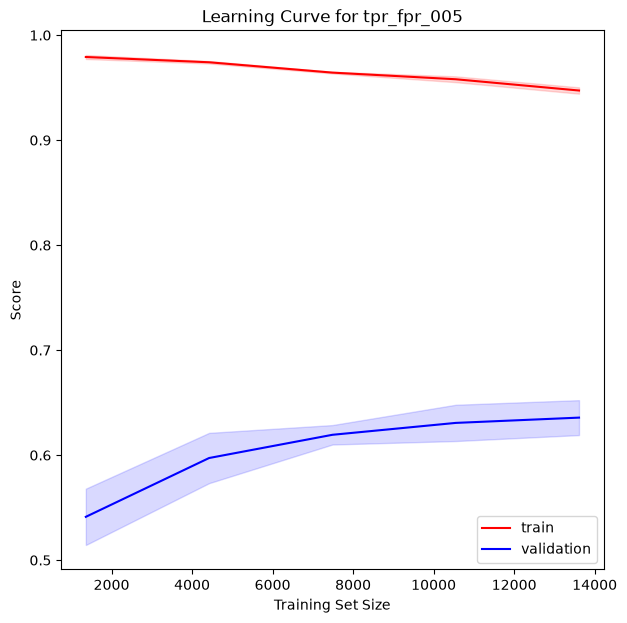
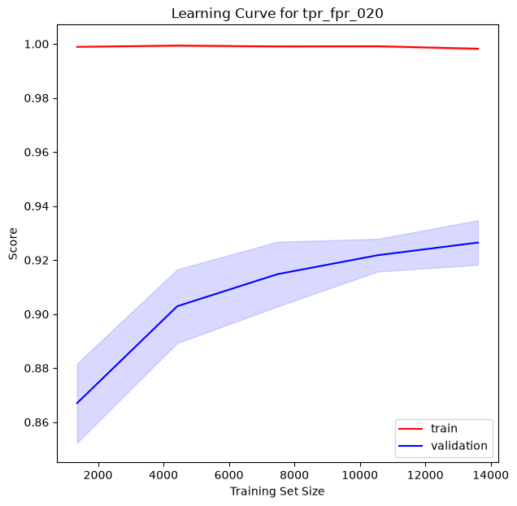

# Gamma/Hadron Classification with the MAGIC Gamma Telescope Dataset

## Project Overview

This project investigates the classification of gamma-ray events and hadronic background events using machine-learning methods.

The dataset is based on simulated measurements from the **MAGIC (Major Atmospheric Gamma Imaging Cherenkov) Telescope** and contains image parameters describing atmospheric particle showers recorded by the telescope.

The main objective is to distinguish between:

- **Gamma events (`g`)** → signal
- **Hadron events (`h`)** → background

The original target labels are converted to:

```text
Gamma  → 1
Hadron → 0
```

## Dataset

The MAGIC Gamma Telescope dataset contains approximately 19,000 simulated
atmospheric shower events and ten numerical image parameters.

The objective is to distinguish between gamma-ray induced showers and
hadronic background events.

### Target Variable

| Target | Meaning | Encoded Value |
|---|---|---:|
| Gamma (`g`) | Gamma-ray induced shower / signal | `1` |
| Hadron (`h`) | Hadronic cosmic-ray shower / background | `0` |

### Data Dictionary
The dataset contains approximately **19,000 observations** and **10 original numerical features** describing the geometry, intensity, concentration, and orientation of the recorded shower images.

| Feature | Type | Unit | Technical Description | Intuitive Interpretation |
|---|---|---:|---|---|
| `fLength` | Continuous | mm | Length of the major axis of the fitted ellipse. | Describes how long the recorded shower image is along its main axis. |
| `fWidth` | Continuous | mm | Length of the minor axis of the fitted ellipse. | Describes how wide the shower image is perpendicular to its main axis. |
| `fSize` | Continuous | #phot (log-transformed) | Base-10 logarithm of the total light content of all pixels in the image. | Represents the overall amount of light recorded for the event. Higher values correspond to brighter or more intense shower images. |
| `fConc` | Continuous | – | Ratio of the summed light intensity of the two brightest pixels to the total image intensity. | Measures how strongly the detected light is concentrated in the two brightest pixels. A high value indicates that a large fraction of the light is concentrated in only a few pixels. |
| `fConc1` | Continuous | – | Ratio of the light intensity of the brightest pixel to the total image intensity. | Measures how strongly the brightest individual pixel dominates the total recorded light. |
| `fAsym` | Continuous | mm | Position of the brightest pixel relative to the ellipse center, projected onto the major axis. | Describes where the brightest pixel is located along the main axis of the shower image and therefore provides information about longitudinal asymmetry. |
| `fM3Long` | Continuous | mm | Cube root of the third moment of the light distribution along the major axis. | Describes the asymmetry of the light distribution along the long axis of the ellipse. Positive and negative values indicate asymmetry toward opposite directions. |
| `fM3Trans` | Continuous | mm | Cube root of the third moment of the light distribution along the minor axis. | Similar to `fM3Long`, but measures asymmetry perpendicular to the main axis and therefore captures lateral asymmetry of the shower image. |
| `fAlpha` | Continuous | degrees | Angle between the major axis of the ellipse and the line connecting the ellipse center with the camera center. | Indicates how well the shower image points toward the center of the camera. Small values mean that the major axis is closely aligned with the camera center. |
| `fDist` | Continuous | mm | Distance between the center of the fitted ellipse and the center of the camera. | Describes how far the shower image is located from the camera center. |

All ten features contain no missing values.

---

## Evaluation Metric

Accuracy is not an appropriate primary performance metric for this problem.

Misclassifying a hadronic background event as a gamma event is more critical than rejecting a true gamma event. Therefore, classification performance is evaluated at predefined limits of the **False Positive Rate (FPR)**.

With gamma events defined as the positive class:

- **False Positive Rate (FPR):** proportion of hadron events incorrectly classified as gamma events
- **True Positive Rate (TPR):** proportion of gamma events correctly identified as gamma events

The TPR is also referred to as **Recall** or **Gamma Efficiency**.

The objective is therefore to maximize the TPR while keeping the FPR below a predefined limit.

The following operating points are evaluated:

```text
FPR ≤ 0.01
FPR ≤ 0.02
FPR ≤ 0.05
FPR ≤ 0.10
FPR ≤ 0.20
```

A custom scorer was implemented to determine the maximum achievable TPR for each FPR limit.

---

## Data Preparation

The dataset does not contain any missing values, so no data imputation is required.

No implausible outliers were identified. Extreme values observed during the univariate analysis were retained because they did not appear anomalous when examined in a multivariate context.

The target classes are slightly imbalanced:

```text
Gamma events:  approximately 65%
Hadron events: approximately 35%
```

Different approaches for handling the class imbalance were compared using logistic regression.

These included different resampling strategies as well as class weighting.

Since the evaluated approaches showed very similar performance, the subsequent models use:

```python
class_weight="balanced"
```

This provides a simple way of accounting for the class imbalance without generating synthetic observations.

---

## Exploratory Data Analysis

The exploratory data analysis focuses on:

- feature distributions
- class-dependent distributions
- potential outliers
- correlations between features
- nonlinear relationships
- multivariate feature relationships
- potential feature redundancy
- physically motivated feature engineering

Several nonlinear relationships between the original features were identified during the EDA.

This motivated the evaluation of nonlinear machine-learning models such as **Support Vector Machines** and **Random Forests**.

The analysis also indicated that the orientation of the shower image relative to the camera center plays an important role in separating gamma and hadron events.

<p align="center">
  
</p>

Selected feature distributions reveal clear class-dependent patterns.
The strongest univariate separation is visible for fAlpha, while morphological features such as fLength and fWidth show broader distributional differences between gamma and hadron events. These patterns indicate that multiple complementary image properties contribute to the classification task.

---

## Feature Engineering

Several additional features were derived from the original telescope parameters.

Examples include:

```text
width_length_ratio
ellipse_area
abs_fAsym
abs_fM3Long
abs_fM3Trans
second_pixel_conc
brightest_pixel_share
alpha_alignment
```

The engineered features represent additional information about:

- shower-image geometry
- absolute values of symmetric features
- light concentration
- dominance of the brightest pixel compared with the two brightest pixels
- alignment of the shower image with the camera center

For example, `alpha_alignment` transforms the original `fAlpha` feature from a range of 0–90° into a range of 0–1:

```text
1 → perfect alignment with the camera center
0 → perpendicular orientation
```

No further transformation of the target variable is required after converting the original `g/h` labels into `1/0`.

---

## Baseline Model

A simple **Logistic Regression** model is used as the baseline.

The baseline model uses:

- all 10 original features
- standard scaling
- no PCA
- no resampling

This model provides a reference point for evaluating whether more complex methods improve classification performance.

---

## Modeling Strategy

Several model families are evaluated and compared using stratified cross-validation.

### Logistic Regression

Logistic Regression is evaluated first.

The experiments include:

1. Logistic Regression without PCA
2. Logistic Regression with PCA
3. Hyperparameter optimization using Bayesian optimization

This provides a comparison between a simple linear model, dimensionality reduction, and optimized model parameters.

---

### Support Vector Machine

Several nonlinear relationships were identified during the exploratory data analysis.

For this reason, a nonlinear **Support Vector Machine (SVM)** is particularly interesting for this dataset.

The SVM is evaluated both with default parameters and after hyperparameter optimization.

Important hyperparameters such as `C` and `gamma` are optimized using Bayesian optimization.

---

### Neural Network

Because the dataset is relatively small, a simple neural network based on scikit-learn's `MLPClassifier` is evaluated first.

The purpose is to investigate whether a neural-network-based approach appears promising before considering more complex deep-learning implementations.

Different network architectures and training hyperparameters are subsequently optimized.

---

### Random Forest

Random Forest showed the strongest performance during the initial model comparison.

The model was therefore optimized again using a broader hyperparameter search space.

The optimized parameters include, among others:

```text
max_depth
min_samples_split
min_samples_leaf
max_features
class_weight
criterion
```

Bayesian optimization with **Optuna** is used for hyperparameter tuning.

The optimized Random Forest was ultimately found to be the best-performing model across all investigated FPR operating points.

---

## Hyperparameter Optimization

Bayesian optimization is used to search for suitable model hyperparameters efficiently.

The optimization is implemented with **Optuna**.

Instead of optimizing a generic metric such as accuracy, the models are optimized directly for the custom TPR-at-FPR scorer.

This allows the optimization process to focus on the region of the ROC curve that is most relevant to the scientific classification problem.

Separate optimization runs can be performed for the different FPR operating points:

```text
FPR ≤ 0.01
FPR ≤ 0.02
FPR ≤ 0.05
FPR ≤ 0.10
FPR ≤ 0.20
```

---

## Model Selection and Test Evaluation

Model selection is performed exclusively using cross-validation on the training dataset.

The test dataset is kept separate during:

- feature engineering decisions
- model comparison
- hyperparameter optimization
- model selection

Only after the best-performing model for each operating point has been selected based on the cross-validation results is it evaluated on the test dataset.

The final test score is calculated using the same custom scorer that was used for the respective FPR operating point.

This ensures that the test set remains an independent estimate of model generalization performance.

The test data are **not used to fit or optimize the models**.

The following heatmap summarizes the cross-validation performance of the evaluated
model variants across the investigated FPR operating points.

Higher values indicate a higher True Positive Rate while respecting the corresponding
maximum False Positive Rate.

<p align="center">
  
</p>

The comparison shows that the nonlinear models outperform the linear baseline,
with the optimized Random Forest achieving the strongest overall performance
across the relevant operating points.

---


## Model Interpretation

### Learning Curves

The learning curves show that model generalization strongly depends on the selected
FPR operating point.

At the stricter operating point of **FPR ≤ 0.05**, the Random Forest achieves nearly
perfect training performance while validation performance remains considerably lower.
This indicates a high-variance regime and shows how difficult it is to maintain high
gamma efficiency while strongly suppressing hadronic background.

At **FPR ≤ 0.20**, the validation score approaches the training score much more closely,
indicating substantially better generalization.

The validation curves continue to improve with increasing training-set size, suggesting
that additional training data could still improve performance, particularly at stricter
operating points.

<p align="center">
  
  
</p>

### Feature Importance

Permutation feature importance was used to investigate which information contributes
most strongly to the domain-specific TPR@FPR metric.

The results show that **image orientation**, represented mainly by `fAlpha` and
`alpha_alignment`, is one of the strongest sources of information for distinguishing
gamma from hadron events.

Additional predictive information comes from image morphology, light concentration,
and event size. The relative importance of these feature groups changes with the
selected FPR operating point, indicating that increasingly strict background rejection
requires a different combination of information.

Because several original and engineered features are correlated, individual importance
values should not be interpreted independently. The results are therefore best
interpreted at the level of feature groups.

<p align="center">
  
</p>
---

## Main Findings

The analysis shows that nonlinear models are considerably better suited to the gamma/hadron classification problem than the simple linear baseline.

The **optimized Random Forest** achieved the strongest overall performance across the investigated FPR operating points.

The results demonstrate that model performance strongly depends on the maximum allowed False Positive Rate.

Very restrictive operating points such as:

```text
FPR ≤ 0.01
```

are considerably more challenging than less restrictive operating points such as:

```text
FPR ≤ 0.20
```

The feature-importance analyses indicate that the most relevant information for distinguishing gamma events from hadronic background is related to:

- orientation of the shower image
- light concentration
- image size
- image morphology

The project therefore demonstrates why evaluation metrics should reflect the requirements of the underlying scientific problem instead of relying only on generic classification metrics such as accuracy.

---

## Repository Structure

```text
project/
│
├── data/
│   ├── raw/
│   │   ├── magic04.data
|   |   |   └── raw data
|   |   └── magic04.names
|   |       └── additional information about dataset
│   │
│   └── processed/
│       └── prepared datasets
│
├── notebooks/
│   ├── Gamma_EDA.ipynb
│   │   └── Exploratory data analysis and feature investigation
│   │
│   └── Gamma_models_thresholds.ipynb
│       └── Training, comparison, validation and interpretation of models for different threshold values for fpr
|
├── results/
|   ├── figures/
|   |   ├── eda_feature_distributions.png
|   |   |   └── distribution of selected features by class
|   |   |
|   |   ├── learning_curve_for_tpr_fpr_001.png
|   |   |   └── Learning curve for final model with FPR operating point 0.01
|   |   |
|   |   ├── learning_curve_for_tpr_fpr_002.png
|   |   |
|   |   ├── learning_curve_for_tpr_fpr_005.png
|   |   |
|   |   ├── learning_curve_for_tpr_fpr_010.png
|   |   |
|   |   ├── learning_curve_for_tpr_fpr_020.png
|   |   |
|   |   ├── model_performance_heat_map.png
|   |   |   └── shows comparison of results of different models at different operating points
|   |   |
|   |   ├── permutation_feature_importance.png
|   |   |   └── shows which information contributes most strongly to the domain-specific TPR@FPR metric
|   |   |
|   |   └── random_forest_feature_importance.png
|   |       └── shows for contribution to the domain-specific TPR@FPR metric for random forests
|   |  
|   └── tables/
|       ├── score_overview.csv
|       |   └── CV scores for different fpr thresholds and models
|       |
|       └── score_table.csv
|           └── Data used for heatmap representation of fpr threshold and models
|
├── src/
|   |
|   ├── baseline_model.py
|   |   └── Baseline-model implementation
|   |
│   ├── features.py
│   │   └── Reusable feature-engineering functions
|   |
|   ├── log_reg.py
|   |   └── implementation of different logistic regression models with and without optimization
│   │
|   ├── neural_network.py
|   |   └── implementation of different neural network models with and without optimization
|   |
|   ├── random_forest.py
|   |   └── implementation of different random forest models with and without optimization

│   ├── resample.py
│   │   └── test of different resample strategies
│   │
│   └── support_vector_machine.py
│       └── implementation of different SVM models with and without optimization
│
├── pyproject.toml
├── .gitignore
└── README.md
```

The notebooks contain the analysis, experiments, visualizations, and interpretation.

Reusable functionality is moved into the `src/` directory to separate implementation details from the analytical workflow and to avoid duplicated code.


---

## Technologies

The project is implemented in Python and primarily uses:

```text
pandas
NumPy
Matplotlib
scikit-learn
imbalanced-learn
Optuna
Jupyter
```

The Python environment and project dependencies are managed using **uv**.

---

## Workflow

The overall project workflow can be summarized as:

```text
Raw Data
   │
   ▼
Exploratory Data Analysis
   │
   ▼
Data Preparation
   │
   ▼
Feature Engineering
   │
   ▼
Baseline Model
   │
   ▼
Initial Model Training
   │
   ├── Logistic Regression
   ├── Support Vector Machine
   ├── Neural Network
   └── Random Forest
   │
   ▼
Bayesian Hyperparameter Optimization
   │
   ├── Optimized Logistic Regression
   ├── Optimized Support Vector Machine
   ├── Optimized Neural Network
   └── Optimized Random Forest
   │
   ▼
Model Comparison
   │
   ├── Baseline model
   ├── Simple models
   └── Optimized models
   │
   ▼
Cross-Validation Model Selection
   │
   ▼
Best Model for Each FPR Operating Point
   │
   ▼
Independent Test Evaluation
   │
   ▼
Learning Curves
   │
   ▼
Feature Importance Analysis
```

---

## Conclusion

This project demonstrates an end-to-end machine-learning workflow for a scientific binary-classification problem.

A key aspect of the project is the use of a domain-specific evaluation strategy. Instead of optimizing generic classification accuracy, model performance is evaluated by maximizing gamma efficiency while explicitly limiting the fraction of hadronic background events incorrectly classified as signal.

The comparison of several model families shows that nonlinear methods substantially outperform the linear baseline.

Among the evaluated approaches, the optimized Random Forest provides the strongest overall performance across the investigated operating points.

The combination of domain-specific scoring, cross-validation, Bayesian hyperparameter optimization, learning-curve analysis, and feature-importance methods provides both strong predictive performance and insight into the underlying classification problem.
